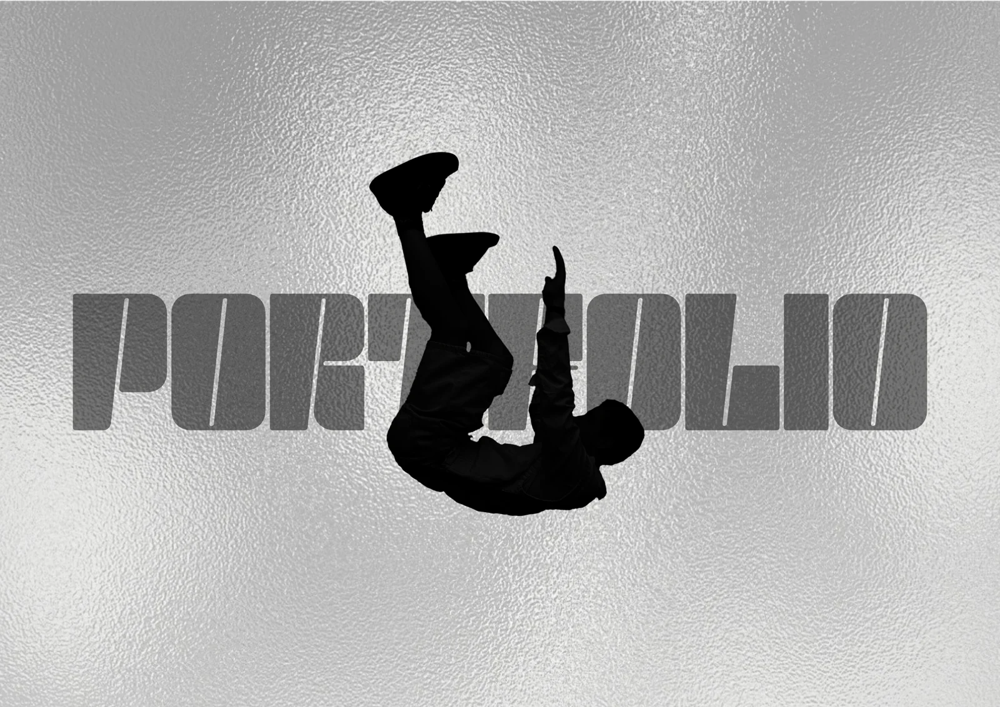

<picture>
  <source media="(prefers-color-scheme: dark)" srcset="assets/hero-cover.webp">
  
</picture>

<p align="center">
  <a href="https://lorenzoperassi.it"><strong>lorenzoperassi.it</strong></a>
</p>

<p align="center">
  
  
  
  
  
  
</p>

---

## about

Portfolio personale di Lorenzo Perassi — developer, founder di Customly e studente di Informatica. Un portfolio orientato alla vendita: siti web, custom fashion e contenuti video per brand, locali e piccole imprese, con un percorso in 4 step, testimonianze e FAQ.

## sezioni

| Sezione          | Descrizione                                                                     |
| ---------------- | ------------------------------------------------------------------------------- |
| Hero             | Branding personale con badge disponibilità, typewriter, contatori e link social |
| Servizi          | Web design vetrina (250€+) e mantenimento continuativo (30€+/mese)              |
| Comparison Slider| Componente interattivo Prima/Dopo ("Dalla creazione al risultato finale")       |
| Perché Scegliermi| 4 punti di forza per mostrare i vantaggi del lavoro diretto rispetto a un'agenzia|
| Projects         | Progetti selezionati: Customly, CRYBU e Custom Fashion                          |
| Customly         | Sezione dedicata alla piattaforma Customly con descrizione e CTA al sito        |
| Experience       | Timeline con esperienze: Customly, Omnia4Web, Stage IT Bertolotto e ITIS        |
| Certificazioni   | Certificazioni (es. CS50x Harvard) con link alla repository GitHub              |
| Tools & Skills   | Griglia di competenze divisa per categoria con tooltip                          |
| Contact          | Form di contatto Formspree + Configuratore interattivo di preventivo + WhatsApp |

## tech stack

- **HTML5** — Semantico, accessibile, SEO-ready con JSON-LD, Open Graph, Twitter Cards
- **CSS3** — Custom properties, animazioni, glassmorphic UI, responsive, `clip-path`
- **JavaScript** (vanilla) — Slider prima/dopo, mouse glow tracking, IntersectionObserver, drag scroll, lightbox, filtri progetti, i18n IT/EN
- **Bootstrap 5.3** — Navbar, griglia, layout responsive
- **Express** — Server con compressione e caching immutabile degli asset statici
- **Devicon** — Icone tecnologie
- **Formspree** — Backend form serverless
- **Google Fonts** — Space Grotesk, JetBrains Mono, IBM Plex Mono, Fraunces

## features

- **Tema scuro** con bordo accent e **Mouse Glow Effect** di sfondo che segue il cursore
- **Interactive Before/After Slider** per confrontare codice sorgente e risultato finale del sito
- **Configuratore di preventivo interattivo** in 2 colonne nel form di contatto
- **i18n** — Italiano/Inglese con salvataggio preferenza in localStorage
- **Filtri progetti** — All · Client Work · Personal Project
- **Lightbox** per immagini e video con navigazione touch, swipe e frecce
- **Progress bar** di lettura e pulsante Back-to-Top
- **Tipografia animata** (typewriter) e contatori
- **Timeline esperienze** interattiva
- **SEO** — JSON-LD, Open Graph, Twitter Cards, sitemap.xml, robots.txt
- **Accessibilità** — Gerarchia heading, aria-label, focus visible, skip navigation
- **100% mobile responsive**

## struttura

```
├── index.html
├── server.js                  # Express server (compressione, caching)
├── package.json
├── css/
│   ├── combined.css           # CSS sorgente
│   └── combined.min.css       # CSS minificato (production)
├── script.js                  # JS sorgente
├── script.min.js              # JS minificato (production)
├── script.min.js.map          # Source map per debug
├── assets/
│   ├── *.jpg / *.png / *.avif # Immagini portfolio
│   └── *.mp4 / *.mov          # Video dimostrativi
├── robots.txt
└── sitemap.xml
```

## iniziare

```bash
git clone https://github.com/perassilorenzo/portfolio.git
cd portfolio
bun install
bun run start     # http://localhost:3000
```

Per sviluppo:

```bash
bun run build     # minifica CSS + JS
```

## build

| Comando             | Azione                                              |
| ------------------- | --------------------------------------------------- |
| `bun run build:css` | Minifica `css/combined.css` → `combined.min.css`    |
| `bun run build:js`  | Minifica `script.js` → `script.min.js` + source map |
| `bun run build`     | Esegue entrambi i comandi                           |

## contatti

- **Email:** perassi.lorenzo1804@gmail.com
- **Instagram:** [@diario_di_uno_09](https://www.instagram.com/diario_di_uno_09)
- **TikTok:** [@diario_di_uno_09](https://www.tiktok.com/@diario_di_uno_09)
- **YouTube:** [@diario_di_uno_09](https://www.youtube.com/@diario_di_uno_09)
- **LinkedIn:** [perassilorenzo](https://www.linkedin.com/in/perassilorenzo/)
- **Linktree:** [linktr.ee/lollo_pera](https://linktr.ee/lollo_pera)

---

<p align="center">
  Built with ❤️ by Lorenzo Perassi · MIT License
</p>
